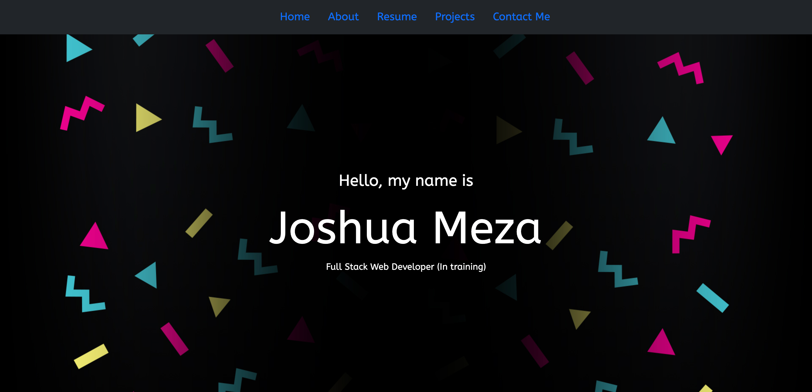
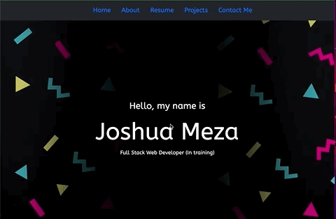
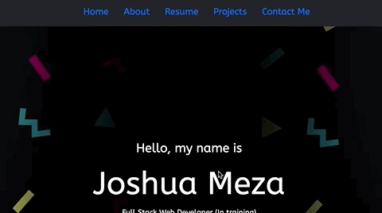
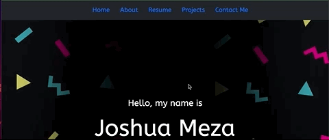
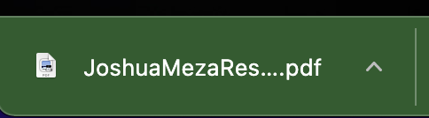
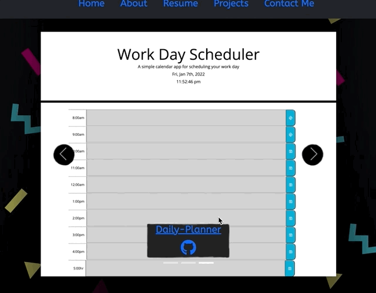
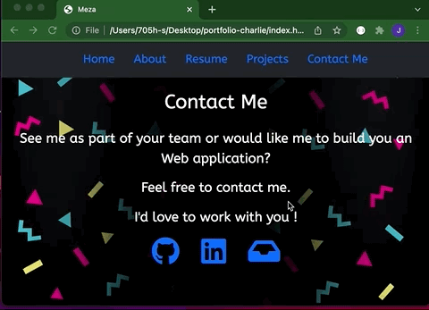

# Portfolio


---

## Table of Contents

* [Built with](#built-with)
* [APIs](#apis-used)
* [Live link](#deployed-link)
* [Site Layout](#layout)
* [Functionality](#functionality)
* [Learning points](#learning-points)

---
## Built With

* [HTML](https://developer.mozilla.org/en-US/docs/Web/HTML)
* [CSS](https://developer.mozilla.org/en-US/docs/Web/CSS)
* [Javascript](https://developer.mozilla.org/en-US/docs/Web/JavaScript)
---
## Apis Used

* [AOS](https://michalsnik.github.io/aos/)
* [jQuery](https://jquery.com/)
* [Bootstrap](https://getbootstrap.com/)

---
## Deployed Link

* [Portfolio](https://705h-s.github.io/portfolio-charlie/)



---

## Layout

The site is made up of one column and five rows. Each Row is margined with 200px top and bottom. Upon Scrolling each section will  appear on the screen through animations.
The Resume doesn’t have a section but instead a modal, where users can download a pdf of the resume.

    

---

## Functionality

### Animate on Scrolling  

Thanks to the AOS library I am able to do animation on scrolling 




 > code to get and display current weather data

```javascript


   
```
---

### Nav Links

User can scroll through the page with Nav Links 



---


### Resume Download

Users can access my resume by clicking on resume through the nav. A modal will then appear, with the option to download my resume in a .PDF format.


> PDF Format 



---

### Mobile response

Users can browse my portfolio on their phones 


---

### Projects 

User can browse my projects and access the deployed site and code repo.


___

### Contact Information

User can accesss my contact information by clicking on the icons.



---

### Old portfolios to reference too 

 Here are my old portfolios. As you can see I have improved over the course of a month.

 [First Portfolio](https://705h-s.github.io/prework-about-me/)

 [secound Portfolio](https://705h-s.github.io/Porfolio-Beta-/)

---

## License
for UC Berkely Extention bootcamp program 

### AOS: <br>
The MIT License (MIT)
Copyright (c) 2015 Michał Sajnóg


### jQuery: <br>
©  2022 OpenJS Foundation and jQuery contributors. All rights reserved.


### Bootstrap: <br>
Code licensed MIT, docs CC BY 3.0.
Currently v5.1.3.

---
#### Author and App developer -  Joshua Meza 
[GitHub](https://github.com/705h-S) <br>
[linkedin](https://www.linkedin.com/in/joshua-meza-918b77224/)